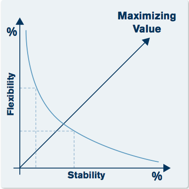

# Service Transition

Time to deliver what has been designed. Receive [Service Design Package (SDP)](ServiceDesign.md#service-desing-package) and bring it into the Operational Stage.
This is the time adjustments will need to be made based on Design changes due to business circumstances, assumptions or requirement changes.

* Majority of IT projects do not yield desired results/outputs.
* Near 80% of incidents are caused by failed changes and activities within IT.

## Objectives

* Planning & managing changes
* Manage risk
* Deploy releases
* Set exceptions and ensure Business __Value__
* Provide Knowledge and information about service

> Change Management

## Scope

* New or changed services
* Service retirement
* Transfer of Services between Service Providers
* Change of service management capabilities

> Transfer of Services between service providers

## Value to the Business - Slide 5

Business is in constant change

Service Transition provides:

* More accurate estimations for projects
* Clear way of working

## Technology and Architecture in Service Transition

__ON TEST__

* Service Knowldege Management
* Configuration Management System (CMSDB)

> Part of Knowledge Management System
>
> Store everything about CI

## Process

* [Change Management](ServiceTransition/ChangeManagement.md)
* [Service Asset and Configuration Management](ServiceTransition/ServiceAssetAndConfigurationManagement.md)
* [Release and Deployment Management](ServiceTransition/ReleaseAndDeploymentManagement.md)
* Service Validation and Testing
* Change Evaluation
* [Knowledge Management](ServiceTransition/KnowledgeManagement.md)
* Transition Planning and Support

Design &rarr; __Transition__ &rarr; Operation

